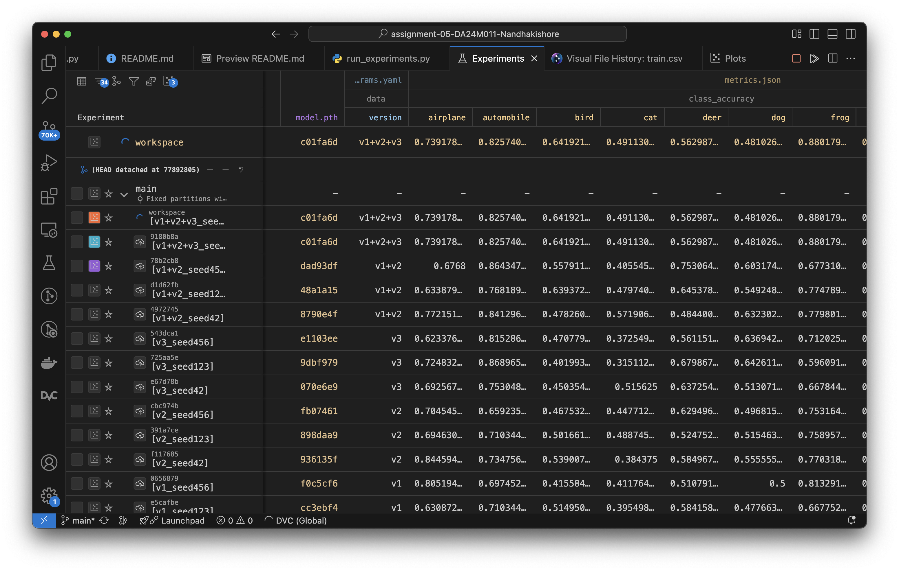
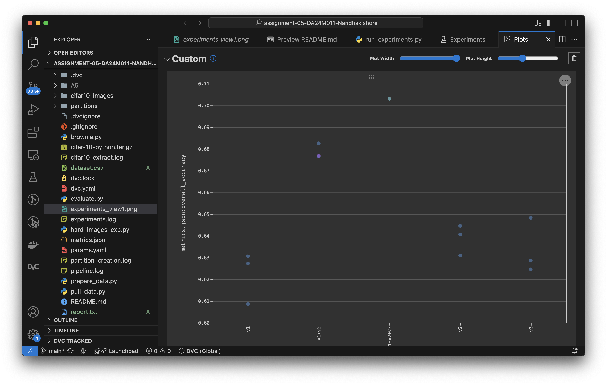
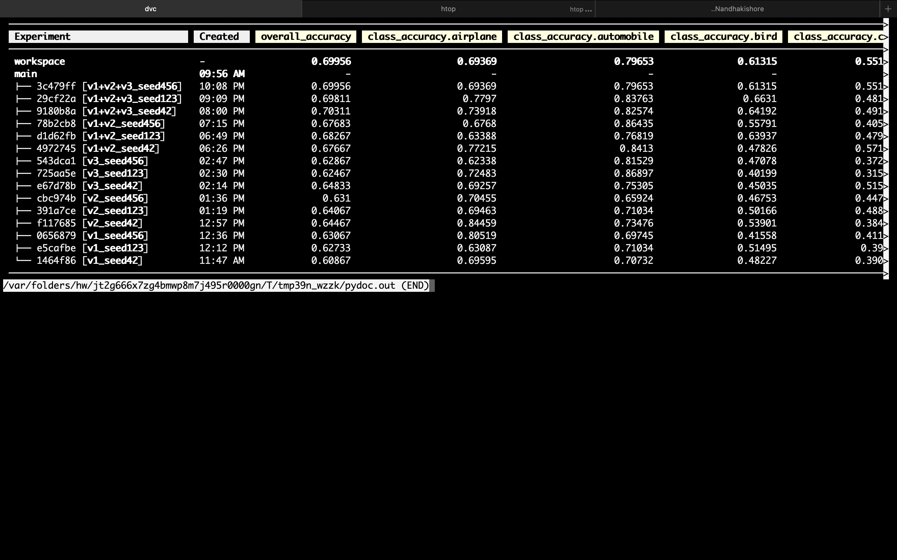

[](https://classroom.github.com/a/l5PrKmPi)


**Submitted by:** Nandhakishore C S <br>
**Roll Number:** DA24M011

I was not able to do a report - all the details & neccesary commands for the assignments are properly documented in this README file. 

## Setup: 

Create a virtual environment and install the required packages 
```console
$ python3 -m venv myenv 
$ pip install -r requirements.txt
```
## Task 1 - Download CIFAR10 dataset

To download the CIFAR 10 dataset, run the file task1.py 
```console
$ python3 task1.py
```

You will get a .tar.gz file with a folder with images sorted in classes <br>

**Directory structure**

```console
├── cifar-10-python.tar.gz
├── cifar10_extract.log
├── cifar10_images
│   ├── airplane
│   ├── automobile
│   ├── bird
│   ├── cat
│   ├── deer
│   ├── dog
│   ├── frog
│   ├── horse
│   ├── ship
│   └── truck
```

## Task 2 - Create partitions and start DVC

Once the downloaded dataset is extracted, three non overlapping partitions are created and stored in the local disk in the same folder and checked out into dvc <br>

```console 
$ python3 task2.py
```

The directory should look like this: 

```console
├── cifar-10-python.tar.gz
├── cifar10_extract.log
├── cifar10_images
│   ├── airplane
│   ├── automobile
│   ├── bird
│   ├── cat
│   ├── deer
│   ├── dog
│   ├── frog
│   ├── horse
│   ├── ship
│   └── truck├── partition_creation.log
├── partitions
│   ├── partition_v1
│   ├── partition_v1.dvc
│   ├── partition_v2
│   ├── partition_v2.dvc
│   ├── partition_v3
│   └── partition_v3.dvc
├── task1.py
├── task2.py
```

To initialise DVC: 
```console
$ dvc init 
$ dvc add partitions/partition_v1
$ dvc add partitions/partition_v2
$ dvc add partitions/partition_v3

$ dvc push
```

For my ease of handling data, I have tagged the datasets <br>


```console 
$ git add .
$ git commit -m "Add partitions v1, v2, v3"
$ git tag -a v1 -m "Partition v1"
$ git tag -a v2 -m "Partition v2"
$ git tag -a v3 -m "Partition v3"
$ git push --tags

```
### Task3 - Setting up DVC pipeline

To pull and push datasets to perferm experiments, the following python scripts are created. 

```console
pull_data.py 
prepare_data.py
train_model.py
evaluate.py
```

- pull_data.py gets one of the partitions of data and does dvc checkout 

- prepare_data.py gets the recent partition and converts the dataset into a dataframe and splits into training, testing and validation data 

- train_model.py uses a simple CNN model (implemented using pytorch) and uses the recent data set to train it. 

- evaluate.py get the inference and classification metrics from the model and pushes it into dvc for visualisation. 

Note that the model used in training and evaluation should be same. For this assignment, they are hardcoded. 

Two .yaml files are created: 
- params.yaml to store different hyperparameters to use in CNN 
- dvc.yaml to setup the dvc pipeline 

**The pipeline is as follows:**

```console
pull_data -> prepare_data -> train_model -> evaluate 
```

Run the follwing command to start the experiments: 

```console 
$ dvc repro
```

## Task 4 - Running Experiments

A python script run_experiments.py is created to run the experiments with dataset(s) **v1, v2, v3, v1+v2, v1+v2+v3**. <br>

This file contains a user defined function to run the experiments with different hyper parameters automatically. 

```python 
def run_experiment(version, seed):
    exp_name = f"{version}_seed{seed}"
    logger.info(f"Running experiment: {exp_name}")
    update_params(version, seed)
    os.system(f"dvc exp run --name {exp_name}")
```

For running the experiments, run the following: 
```console
$ python3 run_experiments.py
```

- When the experiments are run, a metric.json file is created, displaying the accuracies of the current experiment. 

```json
{
    "overall_accuracy": 0.7031111111111111, "class_accuracy": 
        {
            "airplane": 0.7391786903440621, 
            "automobile": 0.8257403189066059, 
            "bird": 0.6419213973799127, 
            "cat": 0.4911308203991131, 
            "deer": 0.5629877369007804, 
            "dog": 0.4810267857142857, 
            "frog": 0.8801791713325868, 
            "horse": 0.8146128680479825, 
            "ship": 0.8013392857142857, 
            "truck": 0.7953539823008849
        }
}
```

- A text file is created (report.txt) which plots the confusion matrix for the current experiment. 
```txt
Class-wise Accuracy:
airplane: 0.7392
automobile: 0.8257
bird: 0.6419
cat: 0.4911
deer: 0.5630
dog: 0.4810
frog: 0.8802
horse: 0.8146
ship: 0.8013
truck: 0.7954

Overall Accuracy: 0.7031

Confusion Matrix:
[[666   8  79  11   4   4  15  23  66  25]
 [ 20 725  10   9   1   4   7   2  27  73]
 [ 54   2 588  38  48  30  71  54  18  13]
 [ 19   3  93 443  31  81 131  58  20  23]
 [ 22   1 137  37 505  16  83  88   5   3]
 [  7   5  95 162  29 431  63  92   8   4]
 [  3   4  47  19  16   4 786   9   3   2]
 [  6   3  53  28  33  19  18 747   3   7]
 [ 63  28  23  14   3   3  16   6 718  22]
 [ 37  63  10   9   4   3  10  22  27 719]]
```

Once the experiments are done, we can see the results in the VScode plugin: <br>



The plots can also be seen in the same plugin: <br>



The results from the experiments are as follows: 



above results, do the follwing command: 

```console
$ dvc exp show
```

## Brownie Question - Find hard to classify images

A python script named brownie.py is created to keep track of images from exepriments which are missclassified. The file also gives the missclassification table. 

```console
$ python3 brownie.py 
```